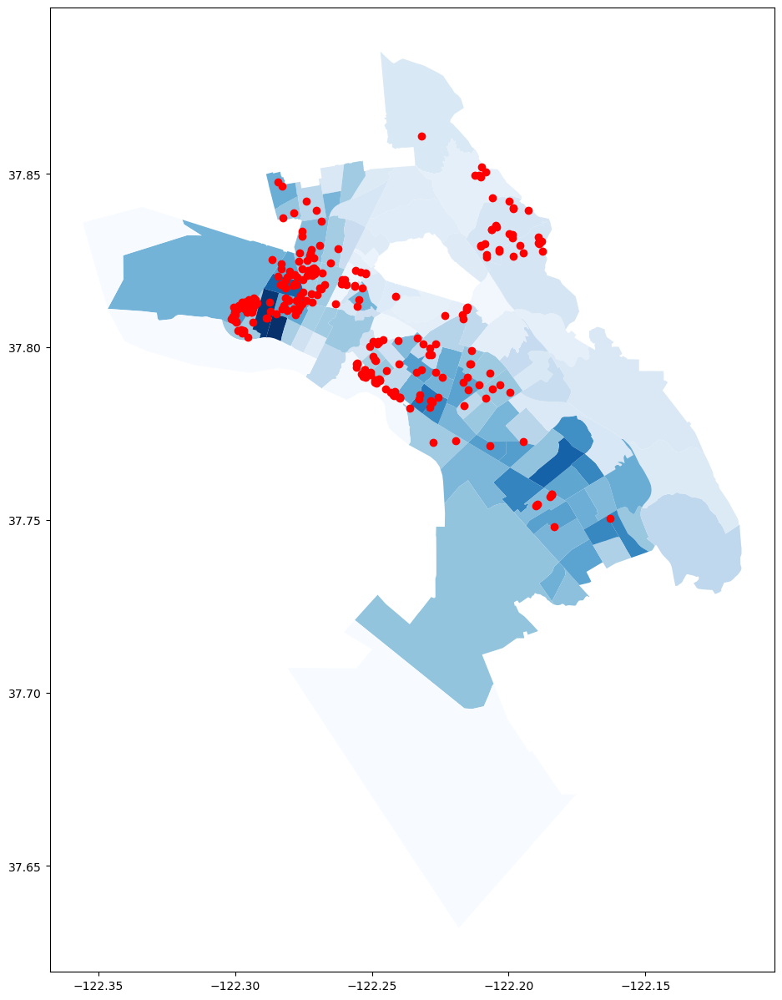

# Landlord-Properties-With-LLCs

I geocoded addresses from a list of landlord owned properties with LLCs in the City of Oakland data portal. I isolated the top two landlords with 255 properties in total, both making up the majority of the the top 1% of property owners. I uploaded an Oakland shapefile into my notebook and colored census tracts by shade gradients showing concentration of single family households in each tract. Darker tracts had a high percentage of single family households. 

Shapefiles can be found from https://data.oaklandca.gov/dataset/Priority-Neighborhoods-Layer/umei-fybz. Landlord LLC data can be found from here https://data.oaklandca.gov/dataset/PRR-11855-Landlord-2015/ujjg-nskp. 

